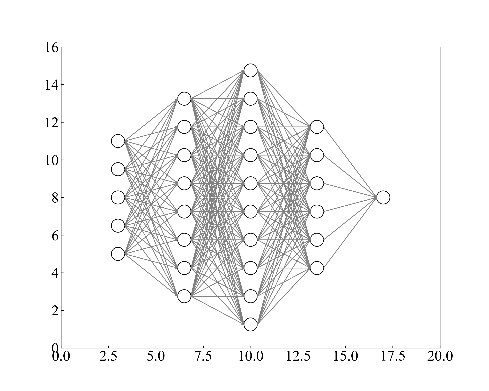
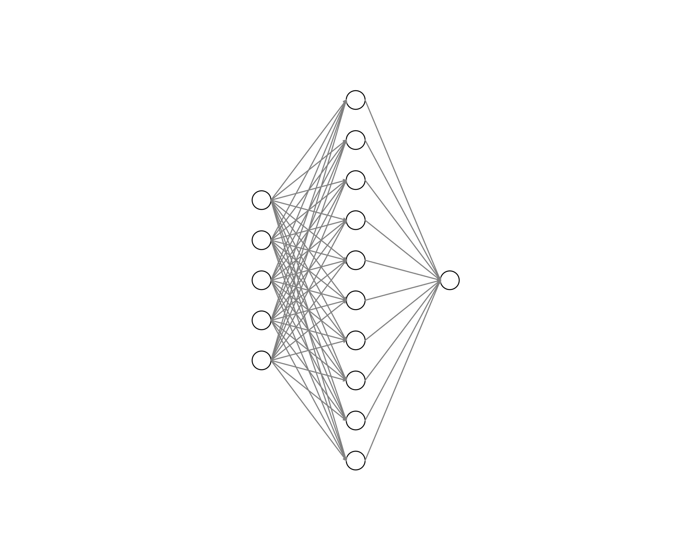

# Neural Network Visualization with Python

- This repository aims to provide a convenient tool for visualizing neural networks using Python. With this library, users can easily create schematic diagrams of neural networks for better understanding and visualization of their architectures.

## Installation

```bash
pip install matplotlib
pip install fastdataing
pip install numpy
```

## Usage

```python
if "__main__" == __name__:
	plotNN(
		nlayers=5, # number of layers
		nneurons=[5,8,10,6,1], # number of neurons
		radius=0.35,
		width_dist=4,
		height_dist=1.5,
		xlen=22,ylen=16,
		linewidth_circle=1,fill=False,
		color_circle="black",alpha=1.0,axis=False
		)
```

## Examples





## Contributing

- Contributions are welcome! If you have any suggestions, bug reports, or feature requests, please open an issue or submit a pull request on GitHub.


## License

- This project is licensed under the MIT License - see the [LICENSE](./LICENSE) file for details.
